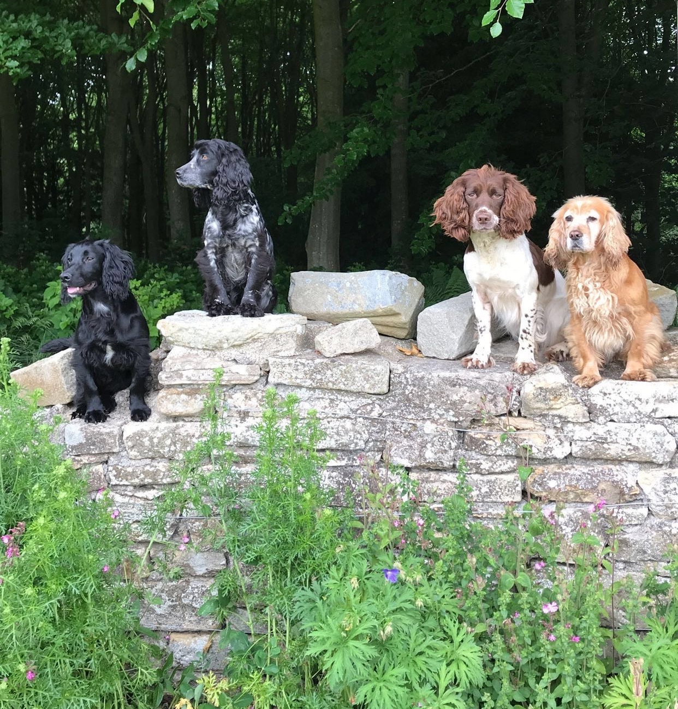
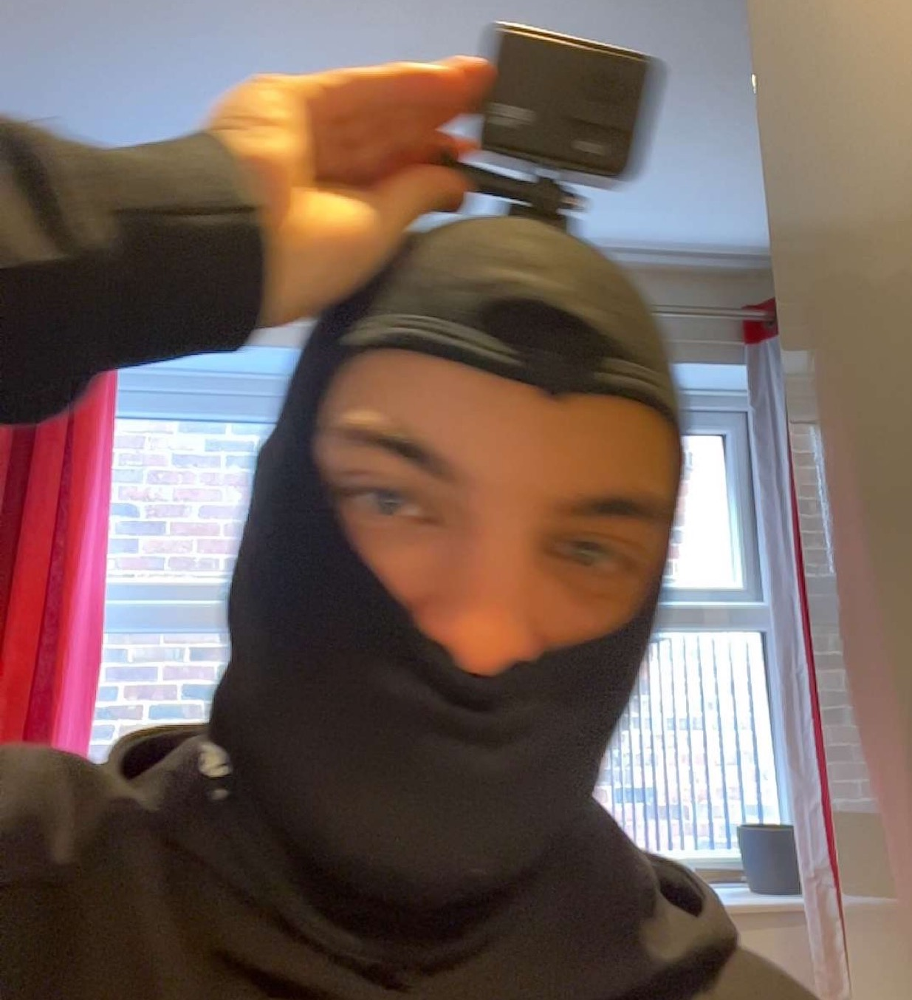

# What is this *chacho*...
And what has it got to do with an interactive story?

Well, you will learn:
- **Who** was behind this interactive story
- **Why** you chose this ending for the interactive story
- **Where** this ending will lead you
- **What** are the next steps

---
# **Who** was behind this interactive story
The individuals behind this interactive story were the following:
- Indie
- Pepper
- Luna
- Barley
- Alejandro
---
# The Team

---
# Indie
*CEO of dogs*

Her input was:
- Director of the entire thing
- Wrote practically all of the script
- Chased Luna around the office aggressively
---

---
# Pepper
*Executive assistant*

Her input was:
- Creative input
- Made changes to the script at some points
- Asked for SO MANY CUDDLES OMG
---

---
# Luna
*Regional Manager*

Her input was:
- Drew the cars in the interactive story
- Debugged most python errors
- Added an Easter egg with code
---

---
# Barley
*Assistant (to the) Regional Manager*

Her input was:
- Deaf
- Couldn't hear what she was told
- Ignored everyone
- Barked at food
---

---
# Alejandro
*Assistant (to the) Assistant (to the) Regional Manager*

His input was:
- Fed Barley
- Helped Luna with the easter egg
- Cuddled Pepper
- Chased Indie aggressively around the office with a toothbrush
- Recorded the shots of the cars flying through the air
---

---

---
# **Why** you chose this ending for the interactive story

- Definitely was NOT tricked to end always in the same ending
- Definitely do NOT try every single alternative scenario to see if its true
- I think there is something like 1 ending(s)

---
# **Where** this ending will lead you
Ending? Jaja. No.

You are not finished.

Oh no.

You have a bunch of other places to go after you are finished with this RStudio presentation. Take it as a sort of Easter Egg hunt, but as a Birthday Egg Hunt (?) idk.

See how far the rabbit hole goes...

---
# **What** are the next steps
This *riddle* will grant you access to the next step:

> Ten total strokes,

> Nine appearing types,

> Six summed at first,

> One swift swipe.

The link is on the next page.

---
# Good Luck

[AND HAVE FUN](https://aleanguera.github.io/)

# Bread👍🏼

