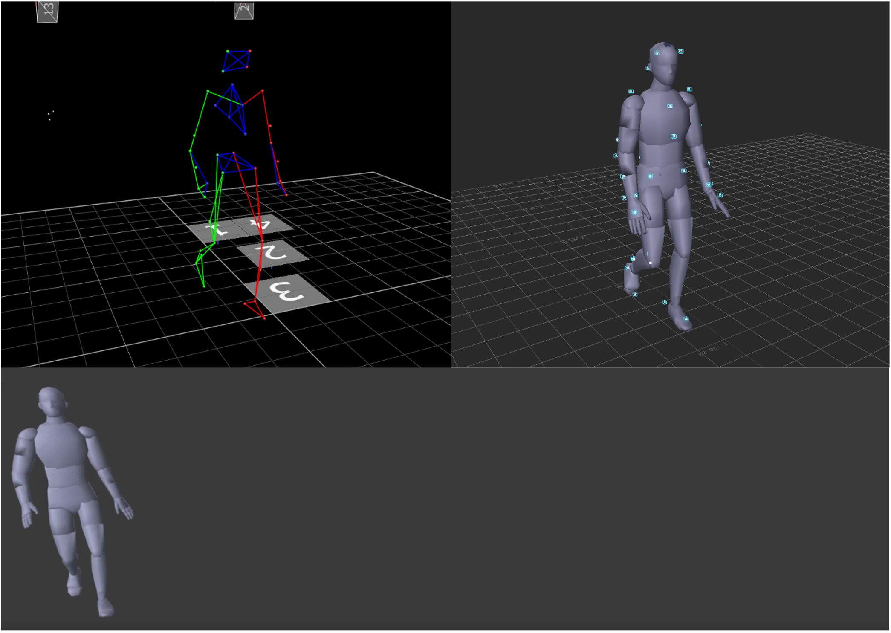

# Hello there...

*Name:* Alejandro Anguera

*Research interests:* Evolutionary and Forensic Psychology

*Interesting fact:* PhD in the trash

*Boring fact:* Toes
---
# **Research interests**

*MRes Thesis:*
Can dominance be detected in the visual periphery from male's walks?

---
# **Interesting fact**
*PhD in the trash:* [Blogpost about it](https://aleanguera670932071.wordpress.com/2022/01/03/cheers-alejandro/)

---
# **Boring fact**

*Toes*:

I have an equal number of toes

I am NOT including a picture of this one
---
# Thank you

# Bread👍🏼
